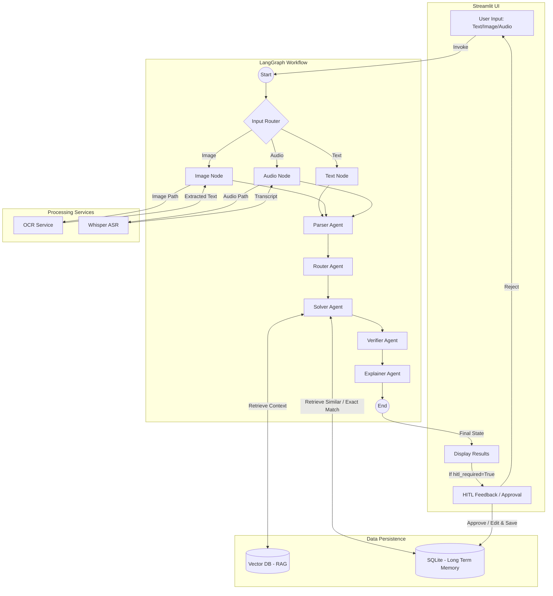

# 📘 AI Math Mentor

👇 Click the below badge to view the live Math Mentor AI App Demo

[](https://math-mentor-ai-app.streamlit.app/)

**AI Math Mentor** is a multimodal educational assistant designed to solve complex mathematics problems (Algebra, Calculus, Probability, etc.). It uses a **LangGraph** agentic workflow to parse, solve, verify, and explain solutions.

The system features **Long-term Memory** and **RAG (Retrieval-Augmented Generation)** to learn from past interactions and improve over time via a **Human-in-the-Loop (HITL)** feedback mechanism.

---

## 🏗 Architecture

The project follows a cognitive architecture where inputs are processed into a standardized state, passed through a chain of specialized AI agents, and verified before being presented to the user.



---

## ✨ Features

-   **Multimodal Inputs**:
    -   **Text**: Type math problems directly.
    -   **Image**: Upload images of equations (processed via `EasyOCR`).
    -   **Audio**: Speak your problem (transcribed via `Faster-Whisper`).
-   **Agentic Workflow**:
    -   **Parser**: Extracts variables and constraints.
    -   **Router**: Determines the math topic and difficulty.
    -   **Solver**: Generates solutions using SymPy and LLMs.
    -   **Verifier**: Checks for logical consistency and confidence.
    -   **Explainer**: Converts the solution into a step-by-step tutorial.
-   **RAG & Memory**:
    -   Retrieves relevant formulas from a knowledge base.
    -   Retrieves **similar past solved problems** to use as few-shot examples.
-   **Human-in-the-Loop (HITL)**:
    -   Users can correct the AI if it's wrong.
    -   Corrections are **saved to memory**, allowing the AI to "learn" and solve similar future problems correctly.

---

## 🚀 Setup & Installation

### 1. Clone the Repository
```bash
git clone https://github.com/yourusername/ai-math-mentor.git
cd ai-math-mentor
```

### 2. Create a Virtual Environment
```bash
# Windows
python -m venv venv
venv\Scripts\activate

# Mac/Linux
python3 -m venv venv
source venv/bin/activate
```

### 3. Install Dependencies
```bash
pip install -r requirements.txt
```
*Note: For GPU support with `easyocr` or `faster-whisper`, ensure you have the correct CUDA drivers installed for PyTorch.*

### 4. Environment Configuration
Create a `.env` file in the root directory or configure your `config/llm.py` with your LLM API key (e.g., Groq, OpenAI).

```env
# Example .env
GROQ_API_KEY=your_api_key_here
```

### 5. Initialize Knowledge Base (Optional)
If you have a folder of text documents for RAG:
```bash
python rag/ingest.py
```

---

## 🏃‍♂️ Running the Application

Run the Streamlit frontend:

```bash
streamlit run app/main.py
```

The application will open in your browser at `http://localhost:8501`.

---

## 📂 Project Structure

```text
📂 ai-math-mentor
├── 📂 agents/             # LangChain Agents (Parser, Solver, Verifier, etc.)
├── 📂 app/                # Streamlit Frontend (main.py)
├── 📂 config/             # Configuration (LLM setup)
├── 📂 memory/             # SQLite + Semantic Search Logic
├── 📂 multimodal/         # OCR and Audio Processing Modules
├── 📂 pipeline/           # LangGraph State Machine Definition
├── 📂 rag/                # Vector Database & Retrieval Logic
├── 📂 utils/              # Helper functions (Math cleaning, etc.)
└── requirements.txt       # Project Dependencies
```

---


